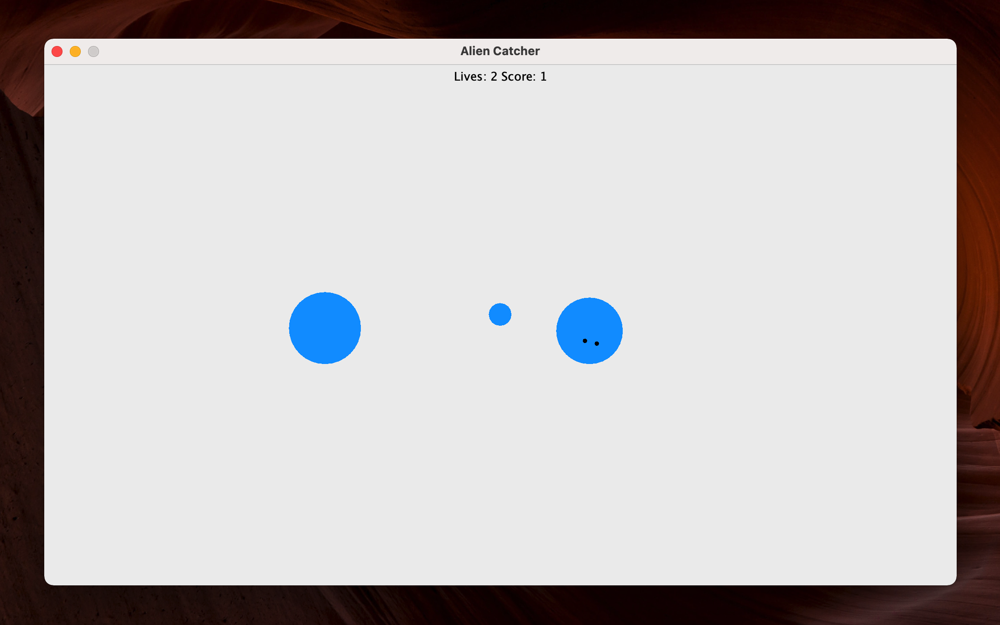
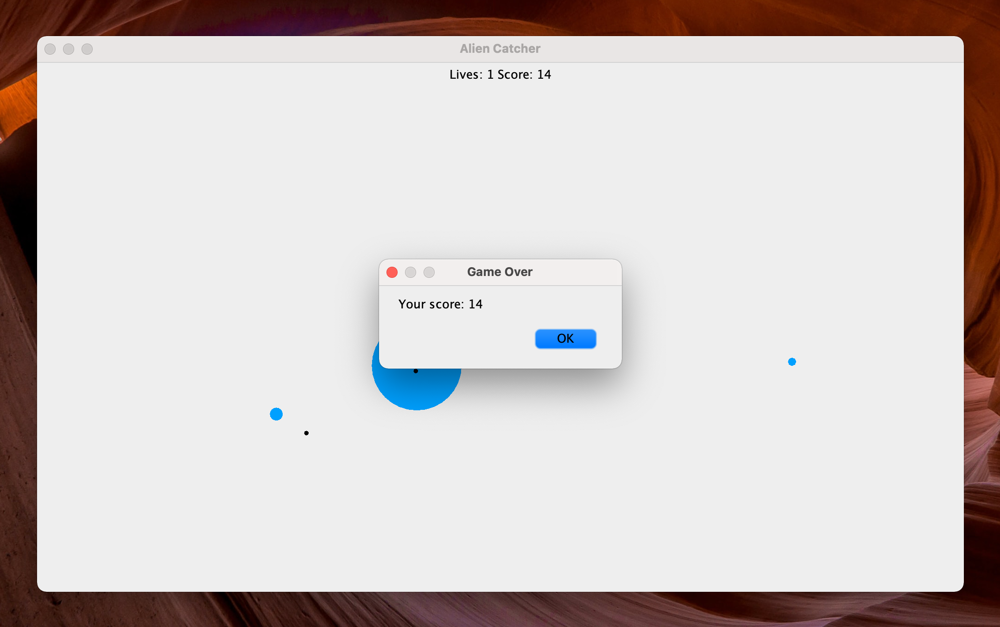
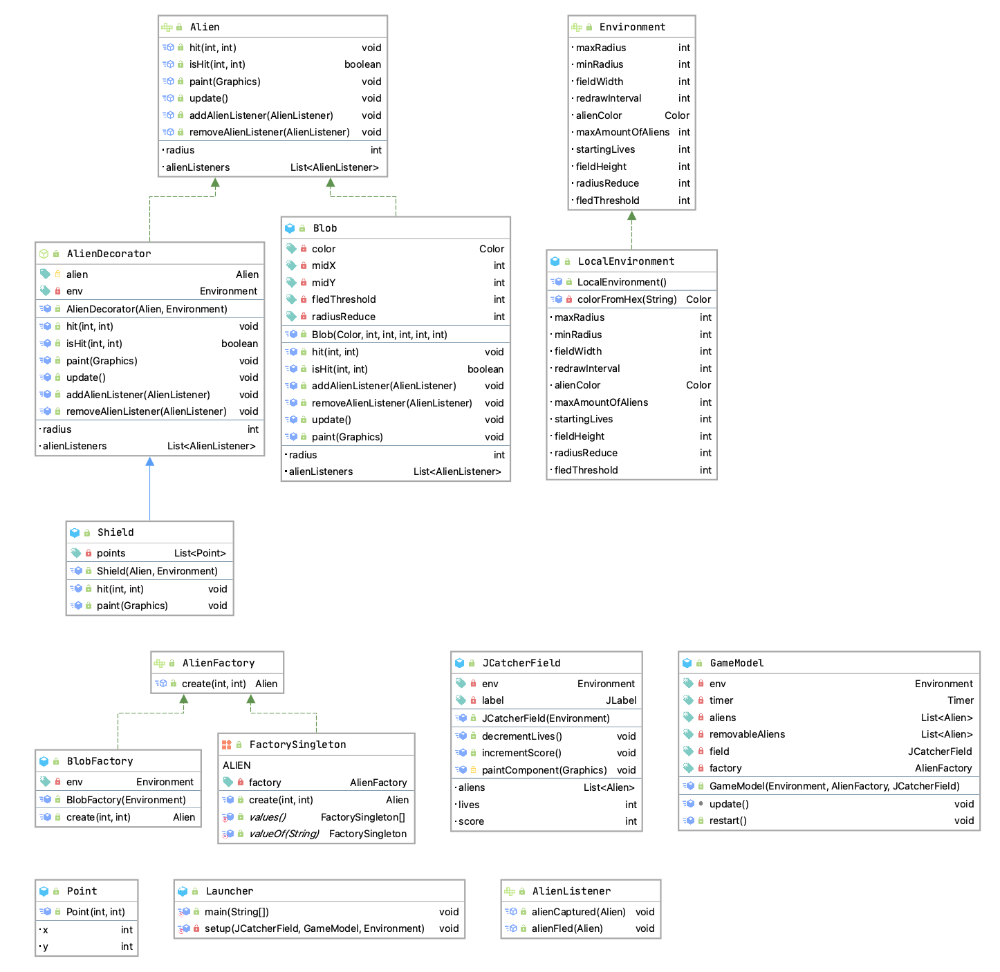

# Alien Catcher

A program to play the game alien catcher as part of a homework in MC404 WS2021 at [FH OÖ Campus Hagenberg](https://www.fh-ooe.at/en/hagenberg-campus).

## 💻 Requirements
* Java 15 (without preview features)

## 🚀 Get Started
**Run part 1 (implementation with blobs)**
```bash
./gradlew runPart1
```

**Run part 2 (factory for blobs)**
```bash
./gradlew runPart2
```

**Run part 3 (factory via singleton)**
```bash
./gradlew runPart3
```

**Run part 4 (alien decorator)**
> Aliens now have a shield, so you need to click three times.
```bash
./gradlew runPart4
```

## ✨ Features





## 🏗 Architecture
Most of the architecture is already given in the [assignment](https://ssw.jku.at/Teaching/Lectures/SW2/2018/Uebungen/UE10/Uebung10.pdf). Therefore, only certain aspects are covered. 



### GameModel
The `GameModel` contains the whole game logic. This includes:

* Generates the aliens and registers a listener
* Reacts to the `alien captured` event
* Reacts to the `alien fled` event
* Manages the timer to update the field

After creating the whole architecture I found out that this class does not really conform to the traditional term `model` of a MVC architecture. To conform with the given class naming I did not change the name.

### JCatcherField
This field is a JPanel which paints the aliens, the score and the remaining lives.

### Environment
Subclasses of this interface provide easy access to configurable values of the application. For instance, `LocalEnvironment` uses the `.env` file to read all the required values. Due to the lack of a dependency injection library this object is passed in the constructor.

### AlienDecorator
This class passes all calls to the decorated object. The concrete decorator `Shield` overrides the `hit` method so the user needs to click three times in order to catch an alien.